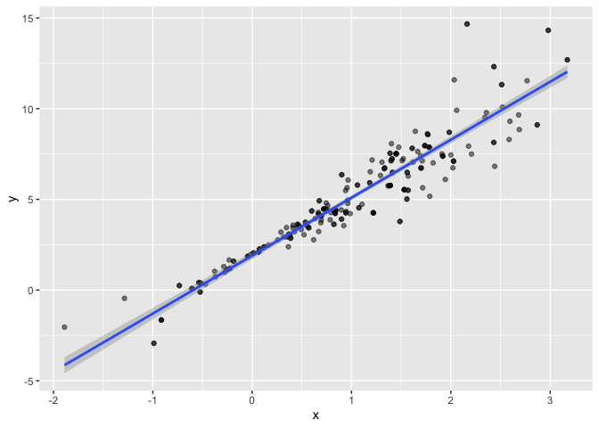
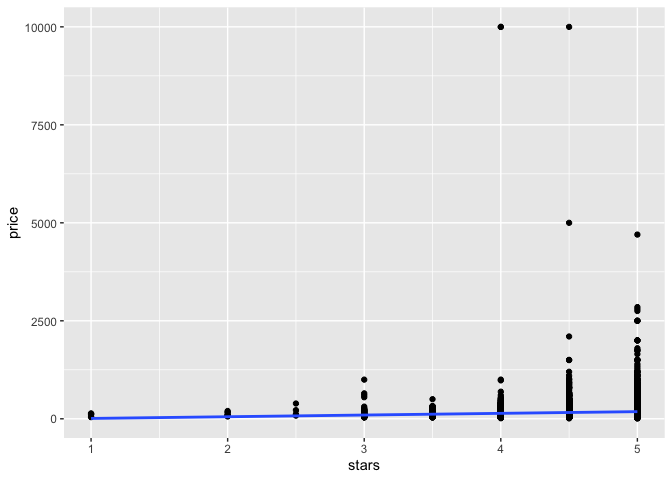
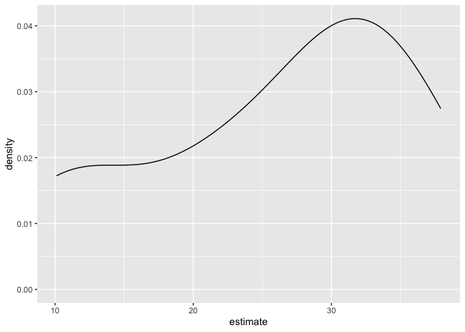

bootstrap
================
Wenjie Wu

do some bootstrapping

make some data

``` r
n_samp = 250

sim_df_constant = 
  tibble(
    x = rnorm(n_samp, 1, 1),
    error = rnorm(n_samp, 0, 1),
    y = 2 + 3 * x + error
  )

sim_df_nonconstant = 
  sim_df_constant |>
  mutate(
    error = error * .75 * x,
    y = 2 + 3 * x + error
  )
```

``` r
sim_df_constant |>
  ggplot(aes(x = x, y = y)) +
  geom_point() +
  stat_smooth(method = "lm")
```

    ## `geom_smooth()` using formula = 'y ~ x'

<!-- -->

Look at regression results

``` r
sim_df_constant |>
  lm(y ~ x, data = _) |>
  broom::tidy() |>
  knitr::kable(digits = 3)
```

| term        | estimate | std.error | statistic | p.value |
|:------------|---------:|----------:|----------:|--------:|
| (Intercept) |    1.977 |     0.098 |    20.157 |       0 |
| x           |    3.045 |     0.070 |    43.537 |       0 |

\##mDraw a bootstrap sample

``` r
boot_sample = function(df){
  
  boot_df = 
    sample_frac(df, replace = TRUE)
  
  return(boot_df)
}
```

``` r
sim_df_nonconstant |>
  boot_sample() |>
  ggplot(aes(x = x, y = y)) +
  geom_point(alpha = .5) +
  stat_smooth(method = "lm")
```

    ## `geom_smooth()` using formula = 'y ~ x'

<!-- -->

``` r
sim_df_nonconstant |>
  boot_sample() |>
  lm(y ~ x, data = _) |>
  broom::tidy() |>
  knitr::kable(digits = 3)
```

| term        | estimate | std.error | statistic | p.value |
|:------------|---------:|----------:|----------:|--------:|
| (Intercept) |    1.896 |     0.098 |    19.311 |       0 |
| x           |    3.142 |     0.069 |    45.636 |       0 |

## bootstrap a lot

``` r
boot_straps = 
  tibble(
    strap_number = 1:1000
  ) |>
  mutate(
    strap_sample = map(strap_number, \(i) boot_sample(df = sim_df_nonconstant)),
    models = map(strap_sample, \(df) lm(y ~ x, data = df)),
    results = map(models, broom::tidy)
  )

bootstraps_results =
  boot_straps |>
  select(strap_number, results) |>
  unnest(results) |>
  group_by(term) |>
  summarize(
    boot_se = sd(estimate)
  ) |>
  knitr::kable()
```

## do this all using modelr

``` r
boot_straps = 
  sim_df_constant |>
  modelr::bootstrap(1000) |>
  mutate(
    strap = map(strap, as_tibble),
    models = map(strap, \(df) lm(y ~ x, data = df)),
    results = map(models, broom::tidy)
  ) |>
  select(.id, results) |>
  unnest(results)
```

report

``` r
boot_straps |>
  group_by(term) |>
  summarize(
    boot_est = mean(estimate),
    boot_se = sd(estimate),
    boot_ci_ll = quantile(estimate, .025),
    boot_ci_ul = quantile(estimate, .975)
  )
```

    ## # A tibble: 2 × 5
    ##   term        boot_est boot_se boot_ci_ll boot_ci_ul
    ##   <chr>          <dbl>   <dbl>      <dbl>      <dbl>
    ## 1 (Intercept)     1.98  0.0984       1.78       2.16
    ## 2 x               3.04  0.0720       2.91       3.19

## Airbnb

``` r
data("nyc_airbnb")

manhattan_df = 
  nyc_airbnb |> 
  mutate(stars = review_scores_location / 2) |> 
  rename(
    borough = neighbourhood_group,
    neighborhood = neighbourhood) |> 
  filter(borough == "Manhattan") |> 
  select(price, stars, room_type) |>
  drop_na()
```

``` r
manhattan_df |>
  ggplot(aes(x = stars, y = price)) +
  geom_point() +
  stat_smooth(method = "lm", se = FALSE)
```

    ## `geom_smooth()` using formula = 'y ~ x'

<!-- -->

fit a regression

``` r
manhattan_df |>
  lm(price ~ stars, data = _) |>
  broom::tidy() |>
  knitr::kable(digits = 3)
```

| term        | estimate | std.error | statistic | p.value |
|:------------|---------:|----------:|----------:|--------:|
| (Intercept) |  -34.304 |    22.926 |    -1.496 |   0.135 |
| stars       |   43.303 |     4.777 |     9.066 |   0.000 |

``` r
boots_results = 
  manhattan_df |>
  modelr::bootstrap(10) |>
  mutate(
    strap = map(strap, as_tibble),
    models = map(strap, \(df) lm(price ~ stars + room_type, data = df)),
    results = map(models, broom::tidy)
  ) |>
  select(.id, results) |>
  unnest(results)

boots_results |>
  filter(term == "stars") |>
  ggplot(aes(estimate)) +
  geom_density()
```

<!-- -->

``` r
boots_results |>
  group_by(term) |>
  summarize(
  boot_est = mean(estimate),
  boot_se = sd(estimate),
  boot_ci_ll = quantile(estimate, .025),
  boot_ci_ul = quantile(estimate, .975)
  )
```

    ## # A tibble: 4 × 5
    ##   term                  boot_est boot_se boot_ci_ll boot_ci_ul
    ##   <chr>                    <dbl>   <dbl>      <dbl>      <dbl>
    ## 1 (Intercept)              102.    48.1        44.4      178. 
    ## 2 room_typePrivate room   -125.     3.56     -131.      -121. 
    ## 3 room_typeShared room    -155.     2.62     -158.      -150. 
    ## 4 stars                     26.1    9.71       10.4       37.5
